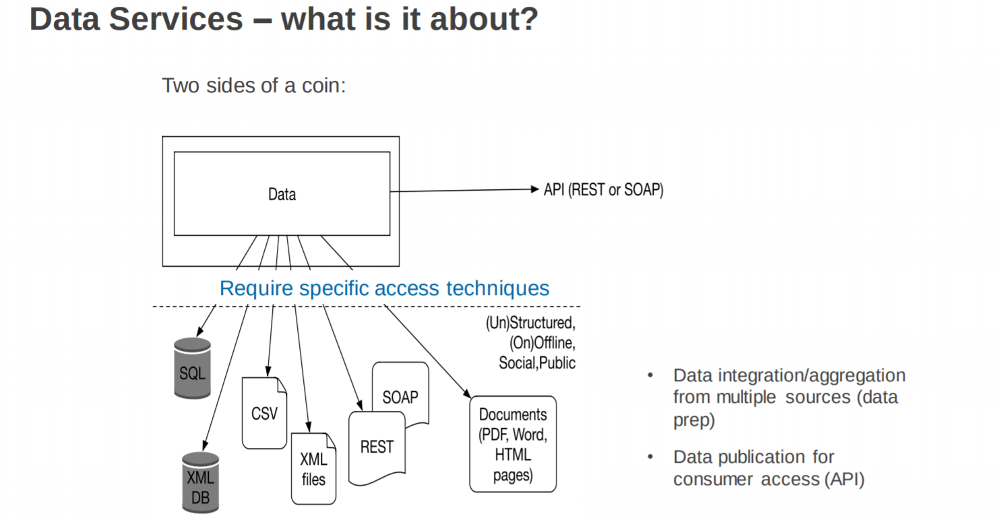
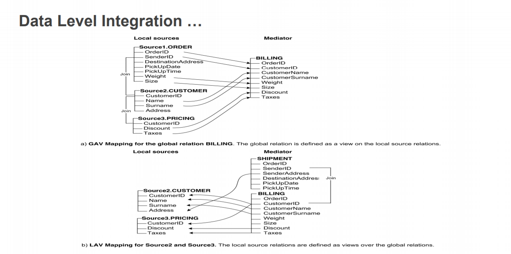
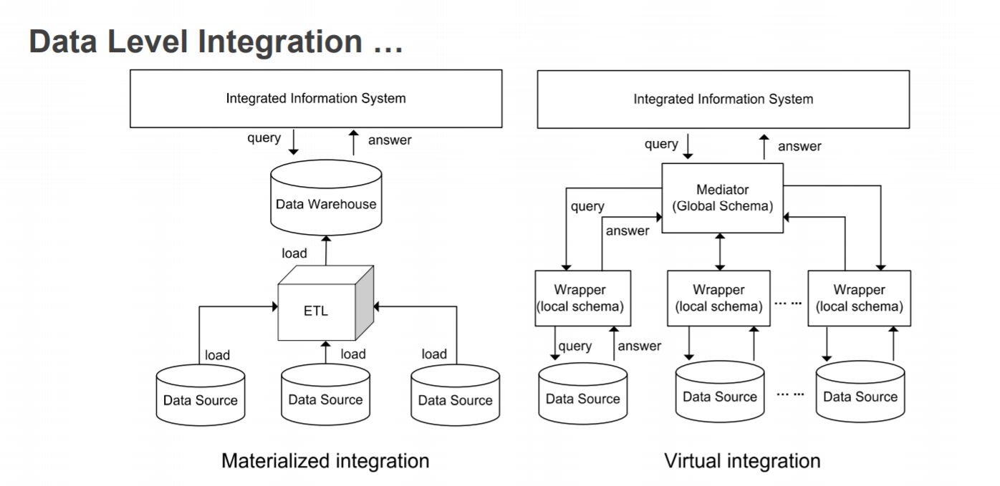

# Data Services

What? - Software services that encapsulate operations on key data entities relevant to the consumer.

Why? - Too many services. Integrating and providing one interface will help make consumption less complex.

Data Integration = combining data from different sources and providing users with a unified view over them.

## Data Level Integration

## Evolution of Programming Abstraction
Functions -> Modules -> Objects -> Components -> Services (ie. Web Services)

## Software Services:
- Servies have explicit contracts that establish their purpose and how they should be used.
- Software services aere supposed to be reuable and composeable
  - Like lego blocks
- Servies Orientation: A way of integrating your application as a set of linked services.
- If you can define the servies, you can begin to link the services to realise more complicated services

Data: raw information, can be found in many places.
- on the web
- in documents in the file system
- spreadsheets
- CSVs, HTML files, JSON, etc

In order to build a data service you need to know how to work with data, ie. 
1. Accessing the data from multiple sources
2. Cleansing the data (eg. removing corrupt or useless data)
3. Manipulating the data (eg. merging, tranforming and normalizing)
4. Preseting the data (visualisation)

# Obtaining Data
Useful data can be found in many places, including:
- on the Web, possibly via an API
- in documents in a file system
- in spreadsheets
- in videos
- etc. etc. etc.

and in a variety of formats, including:
- Unformatted text (in files)
  - Usually unfriendly, requires some sort of processing
    - NLP - Natural Language Processing - Syntax
    - ML - Machine Learning - Patterns
    - Only offers approximations
- PDF documents (in files)
  - which specifies content and layout commands
  - including both text and (mainly) binary data (e.g. OCR)
  - but structure is not necessarily helpful for extraction
  - Python packages (e.g. pyPDF2) for dealing with PDF
    -  aim to extract the text from the document
    -  but don’t aim to keep the layout structure
  -  text chunks don’t necessarily correspond to words
  - More sophisticated extraction from PDF, PDFminer (including pdf2txt.py and dumppdf.py
    -  toolset implemented in Python (v2)
    -  parses PDF documents, both text & images
    -  can convert PDFs to other formats (e.g. HTML)
    -  can output text + layout information
    -  but still requires significant work to extract data
    -  requires NLP/ML, but aided by layout information
- HTML documents (web pages)
  - requires explicit markup, ie. developers have to structure it
  - structure changes from dev to dev (no standard)
  - if document uses javascript it has to be rendered before it can be parsed
  - python lib for parsing html: BeautifulSoup 
- XML documents (via web APIs) / JSON data (often via web APIs)
  - already structured, most commonly used by web service APIs
  - good for representing hierarchical structures
  - have tags to indicate type of data (meta data)
- CSV data files (spreadsheets)
  - may not be normalised (in terms of relational databases)
  - column heads (ie. first row), serve as metadata
  - when reading in pandas, each row is a list and dataframe is list of rows
  - pandas provides functions for filtering and calulating on dataframes

## Data models
Paradigm of thinking about data entities as objects.

Our API treats these models as resources that can be manipulated (ie. created, updated, deleted etc) and retrieved (ie. get)

## Relations Models (SQL)
- data is organised into relations (tables) where each relation holds an unorderd collection of tuples (rows)
- based on solid theory (relational algebra) and well engineered
- most offerings enforce ACID properties
- Problems
  - Normalisation Hell: 3NF -> many fragments -> leading to many joins -> terrible for scalability
  - ORM (Object-relation Mapping): Object-relational mismatch
    - Impendance Mismatch: Problem of a mismatch between application data model (business objects) and data model for storage (relational tables)
    - This mismatch create a need for an awkward translation layer between the objects in the application code and the database model of tables/row/columns.
- Additional Features:
  - some DBMS support 'arrays' where multiple values are stored in a single tupple
  - can be queried and indexed

## NoSQL Models
- greater scalability - very large datasets or high write throughput
- need for more expressive and dynamic data model
- doesn't require a fixed table schema nor do they use concept of joins
- most offerings relax ACID properties
- encodes documents as JSON or XML
- Problems
  - Single documents tend to become more interconnected as more features are added
- Additional Features
  - collections don't enforce schema.
  - documents within a collection can have different fields
  - no joins (everything embedded in a single object)
  - improved 'locality': single retrieval request can get all necessary info
  - reduced impendance mismatch: application models look similar to what is actually stored in the collection

## Relational Model VS Document Models
- Representing relationships (many-to-one / many-to-many) - not so different
  - relational: foriegn keys (id references)
  - document: document references (doc id)
- which data model leads to simpler code?
  - if application model looks like tree -> it can be loaded at once using document-based model
  - if M-M relationship are central to application model -> relational model is efficient in joins. 
    - document model will need to have 'join' code in application code
- Is schema flexibility always a good thing?
  - most document-based dbms don't enforce schemas
    - arbitrary keys and values can be added to a document and when reading clients have no guarantees as to what fields the documents may contain
  - Schema-on-read
    - structure of data in implicity, only interpreted when the data is read by application code. ie. dynamic type checking
  - Schema-on-write
    - traditon approach of RDB - explicity schema and the database enforces all written data conforms to it. ie. static type check
- NoSQL is good for when the schema is always changing and flexibility is needed
- NoSQL is good when objects in collection have different structures
- NoSQL offers better data locality -> retrieving a single document can be faster than joining a bunch of tables
- Convergence of document and relational databases: document-based DBMS (eg. MongoDB) nowadays offer features provided by relational DBMS.

# Graph-like Models
- Good for highly complicated M-M connections -> graph
- Vertices/nodes -> represent entities
- Edges/arcs -> represent relationships
- Many kinds of data can be modelled as a graph
  - Social graph: people are verticies, edges indicate if they know each other
  - Web graph: verticies are web pages, edges are linkes between pages
- Well-known algorithms on the model
- Properties:
  - Verticies
    - identifier
    - set of outgoing edges
    - set of incoming edges
    - attributes (key-value pairs)
  - Edges
    - identifier
    - edge start (vertex identifier)
    - edge end (vertex identifier)
    - a label for the relationship
    - collection of properties
- vertex can have no edges (ie. no schema-based restrictions)
- given vertex -> can efficiently find both incoming and outcoming edges by traversing the graph
- by storing different types of relationships you can store several different kinds of information in a single graph.
- features give graphs a great flexibility for data modelling

## Accessing DB from an application
Data Storage -> Data Access Layer -> Business Logic Layer -> Presentation Logic Layer -> Presentation/GUI
- application code blocks relating to using this library form "data access layer" in the stack.

## Impendance (or Paradigm) Mismatch Problem
- granularity problem: how specific should attributes be? if splitting the attribute should we use different tables (relational)
  - coarse granularity: as a single field
  - fine granularity: as multiple fields
- identity concept model: objects can be either equal or identical:
  - identical = same object (address)
  - equal = same values
  - in RDB, separate concepts don't exist. One concept of identity = primary key (ie. same primary key, same object)
- association problem: to be able to navigate between objects, you have to define the associate twice
  
  eg. 

    User: 
     - billing

    Billing:
     - user

- object-graph navigation: no efficient way to retrieve data from relation tables instead of accessing single objects, you'd do joins

## ORMS (Object Relational Mapping)
- Provides higher-level utilities to handle models as entities
- Used in the business logic layer
- e.g. PyMongo (python), Mongoose (node), ActiveRecord (rails)
Styles of ORM:
- Data Mappers: tries to separate the details of persistence from the objects themselves
  - the idea of 'session', objects and their persistence API as associated with the session. ie. commit changes in a session
- Active Record: has domain object handle their own persistence (kinda like java classes)
  - It is a style of ORM in which the domain object itself has methods to handle their own persistence like save() and delete().
  - persistence logic is attached to object (eg. save)

## Managing and Publishing Metadata
- metadata is a map, is a means by which the complexity of an object is in a simpler form
- eg. catalog for library collection is a simpler representation
Types of metadata
- descriptive metadata: description of an object
- administrative metadata: information about the origin and maintance of an object
- structural metadata: information about how an object is organised
- provencance metadata: traces/process involved in producing the object.

## RDF: Resource Description Statement 
- subject: refers to the entity being described 
- predicate: relationship between subject and object 
- object: Referes to another entity being used to describe the subject

# Data Cleansing
Dataset are messy. Messy data can give wrong insights. Data cleansing inloves:
## Dealing with missing data
- due to: data entry error, computing error
- possible solution: add in default value for missing data (NaN, 0, NA, None etc)
- possible solution: delete rows that have missing data
- possible solution: delete column that have a high incidence of missing data
## Removing unnecessary data (rows or columns)
- some columns might not provide much insight and might be better to remove irrelevant data
- python: use Drop() for this
## Normalising / Formating data
- data from source may not use correct format (eg. dates, types etc)
- some strings may also have incorrect spacing, that can ruin analysis
- sometimes computer-generated columns might be hard to understand/read

# Data Manipulation
## Merging data
- sometimes in  order ot have a complete dataset you need to concatentate two datasets (ie. joining on a field)
## Applying a function to data
- sometimes you need to apply a function on the level of the entire dataset (eg. obtaining an average)
- sometimes you need to apply a function on the level of columns
## Pivot tables
- summary tables
- introduce new columns from calculations
- tables can have multiple indexes
- excel is famous for it
## Change the index of a dataframe
- sometimes it's helpful to use uniquely valued indentifying field of the data as its index
## Groupby
- splits the data into different groups depending on a variable of your choice
- eg. tweets dataset - group by username and count number of tweets for each user

# Data Visualisation
Visualisation isn't just about graphs. Highly competent visualtion tricks can affect what you see and what you pay attention to.

Visualisation transforms data into images that effectively and accurately represent information about the data. Goals include
- to explore: nothing is known
- to analyse: given a hypothesis, visualisatoin is used for verification / falsification
- to explain: communicate results and make them clear for an audience

## What makes good visualisation?
- Accuracy, Story Knowledge: Aim to create a visualisation that's accurate and tells a good story, providing real knowledge to the audience.
 
## Charts vs Graphs
- Often used interchangably, but they are different in terms of the visualisation techniques involved.
- Both rely on established, repeated pattern to show data
- Bar: repeating equal width rectangles along a scale of information
- Comparison chart: repeating tick/cross along a scale of information

## Organising data
- When possible order the data based on the main numerical value etc
- Lots of colours can be confusing, keep it simple
  - Red: stop, danger, money loss etc
  - Green: on, plants, moving, money
  - Blue: cool, safe, deep
  - make sure your colours contrast, so info is easy to read
- Keep scales consistent (easy to mislead)
- Add a legend / map, so it's easy to interpret the visualisation

## Preparing the data for visualisation
- data is almost never comes in the exact form that's needed
- common data adjustments
  - calculating indexes and ratios
    - convert the data so it's easy to look at the data side-by-side that's not necessarily easy to do in the original form
  - calculating percentile
    - calculating percentile makes it easier to compare numbers to each other as part of a whole (where you stand compared to the rset of the herd, ie. relative standing)
  - aggregating
    - process where raw data is gathered and expressed in a summary form for statistical analysis.
    - eg. average, minimum, maximum, sum and count e
  - regrouping
  - converting from excel/csv to json/sql/xml

## The right paradigm
Choosing the right type of graph is sometimes the most difficuilt bit. What do you want to show?
- Distribution
- Relationship
- Comparison
- Connection
- Composition
- Location

Types
- Bar graphs
- Stacked bar graph
- Line graph: for continuos information
- Scatter plot graphs
- Pie cjar
- Histograms: useful for viewing distribution of data points
- Maps: for hierarchical / geographical data

Use matplotlib with pandas for doing visualisations
