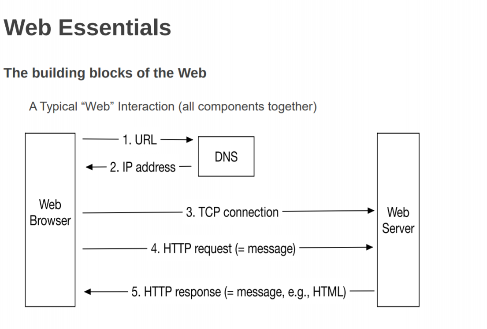
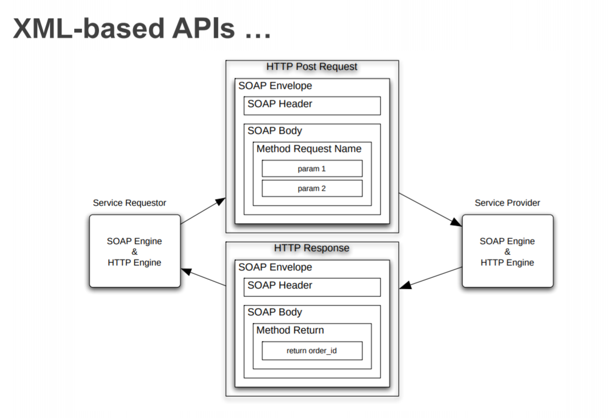
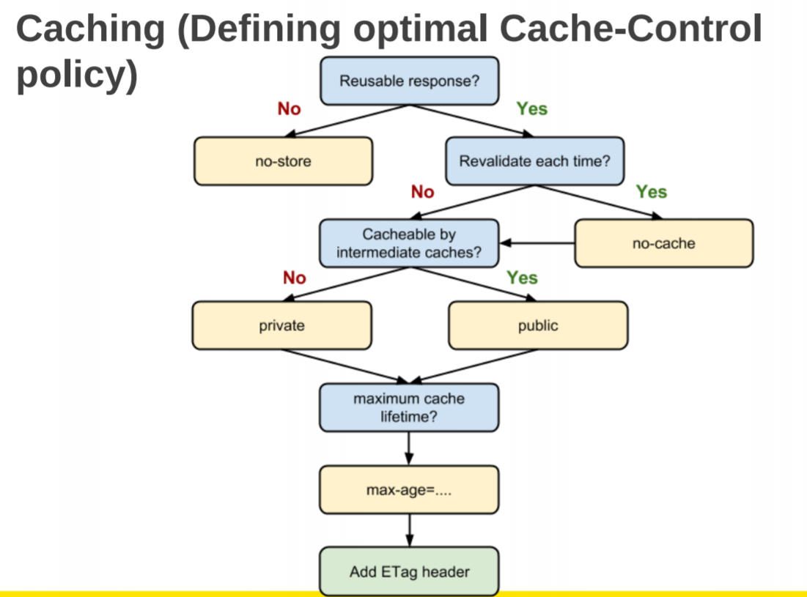
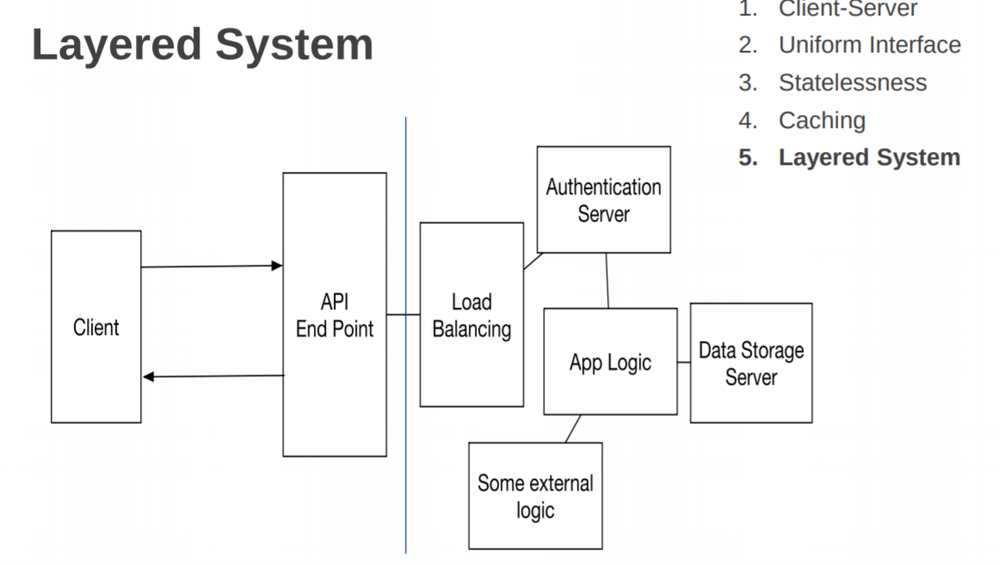
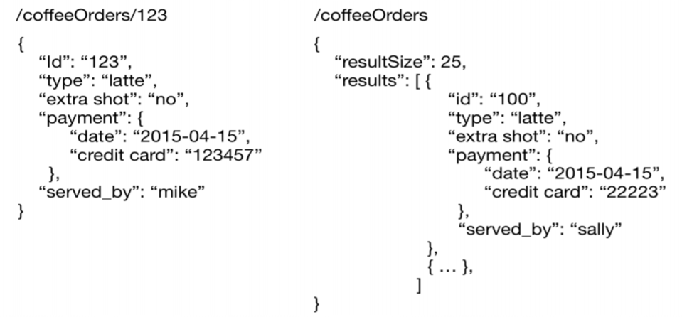
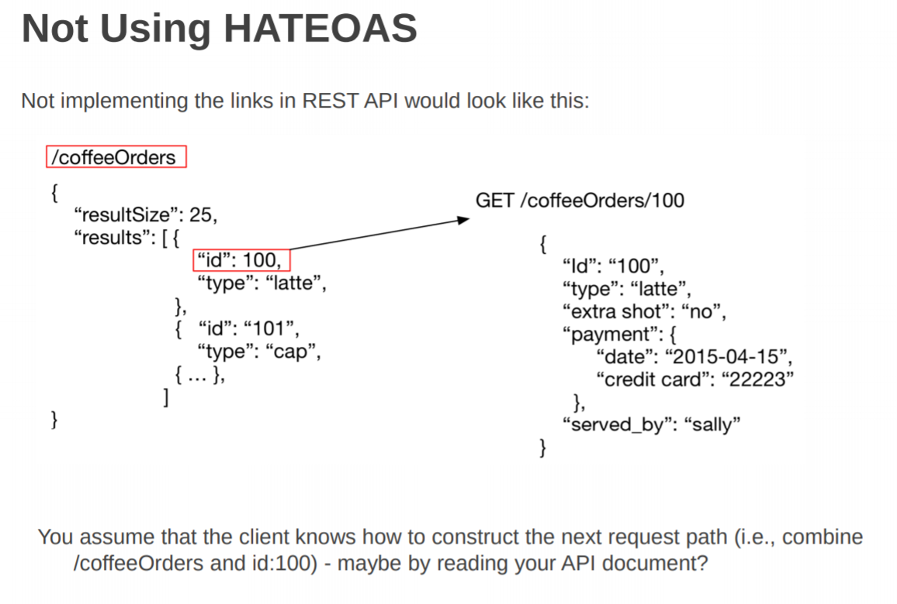
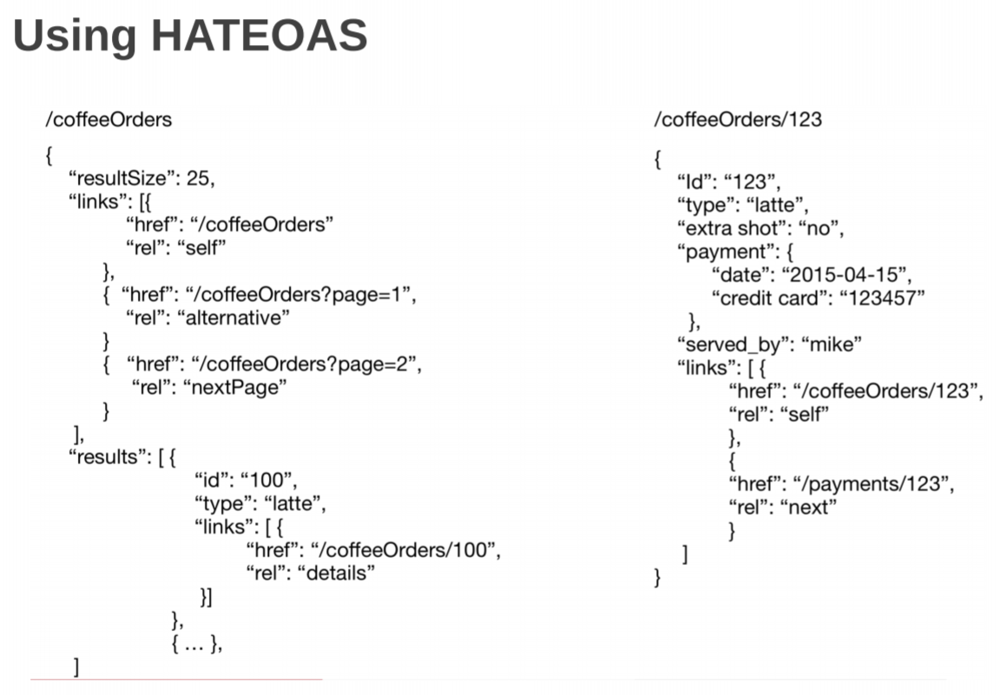
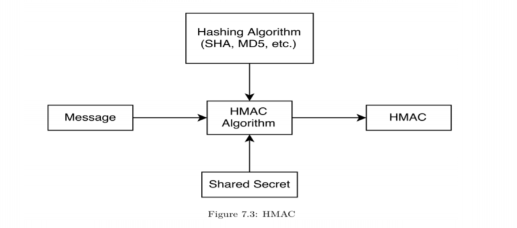
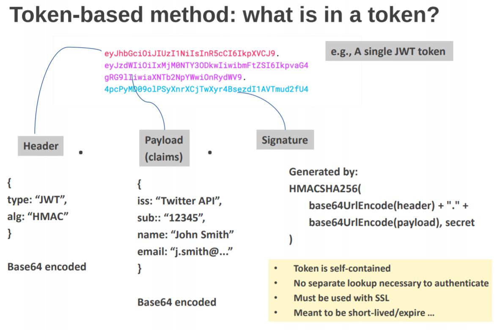
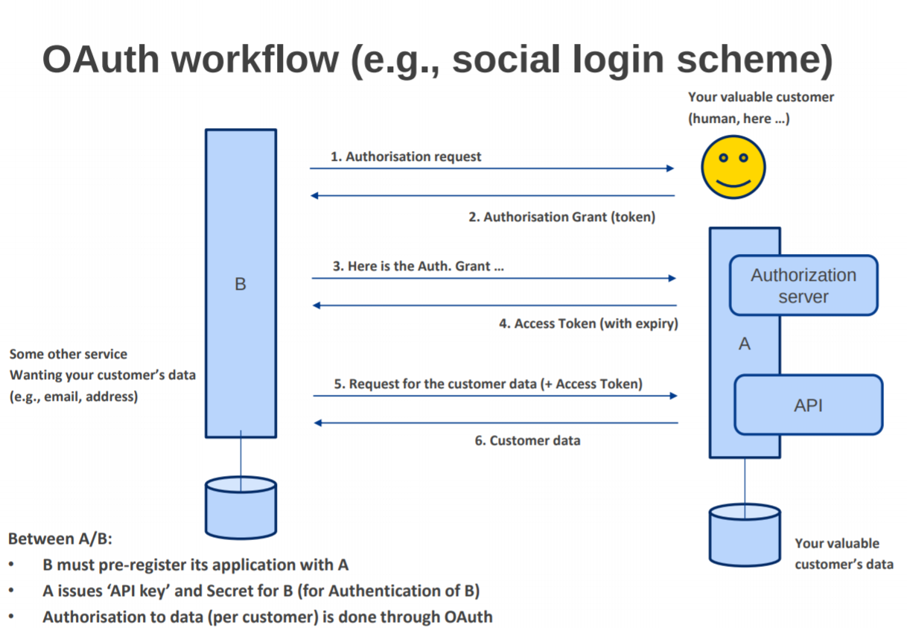

# Web Essentials
Web = Higher level protocol over the internet.

Three basic componentes of the web: 
1. URL (Uniform Resource Locator) - A Uniform Notation Schema for addressing resources
- eg. http(s)://domain/path?query=something#fragment_identifer

2. HTTP (Hypertext Transpot Protocol) - A protocol for transporting messages
- Request line + Header + Additional Data
- eg. GET http(s)://domain/resource
- Must have a newline (CRLF) between the header and the additional data part
- Header might contain: User-Agent, Referer, Authorization
- Additional data (body): block of data in POST etc...

3. HTML (Hypertext Markup Language) - A markup language for formatting hypertext documents
- What webpages are mainly build with. Blah blah blah...

## HTTP Request Methods
* GET     - retreive data identified by the URL
* HEAD    - returns the HTTP headers without the document body
* POST    - used to transfer a block of data to the server (ie. CREATE entities when entity identifier is not known)
* OPTIONS - used to query server about the capabilities it provides.
* PUT     - It stores the body at the location specified by the URI (ie. UPDATE entities when the entity identifier is known)
* DELETE  - used to delete a document from the server.
* TRACE   - used to tract the path of a request through firewall and multiple proxy servers

## HTTP Response / State Codes
Composed of Status Line + Header + Body

Statuses Digits:
* 1 - Informational - provides information to client before processing has been completed
* 2 - Success       - Request has been successfully processed
* 3 - Redirection   - Client needs to use a different resource to fulfill the request
* 4 - Client Error  - Client's request is not valid
* 5 - Server Error  - An error occurred during server processing

Status Codes:
* 200 - OK - Request processed normally
* 201 - Created - Your request creates a new resource
* 301 - Moved Permanently - URI for the requested resource has changed
* 401 - Unauthorised - The resource is password protected and the user has not yet supplied a valid password
* 403 - Forbidden - The resource is password protected and the user has not yet supplied a valid password
* 404 - Not Found - No resource corresponding the URI was found
* 500 - Internal Server Error - Server software detected an internal failure

Header:
  - Content-Type
  - Content-Language
  - Content-Length
  - Cache-Control
  - Authorization

# XML-based APIs

Nowadays JSON/REST is the preferred choice.

# RESTful Services
- Stands for Representational State Transfer (of resources)
- Early XML-based API fell out of favour along with the rise of mobile devices due to the heavy data payload and processing time.
- REST is an architectural style of building networked systems - a set of architectural constraints in a protocol build in that style.
- The protocol in REST is HTTP (the core tech that drives the web)
- REST is not an official standard specification or even a recommendation. It's just a bunch of "design guidelines" for building a system.
- In REST, everything starts and ends with resources (the fundamental unit)
- Resources: Any information can be a resource (ie. document, image a person etc)
  - Any concept that might be the target of an author's hypertext reference must fit within the definition of a resource.
  - is unique (can be identified uniquely)
  - has at least one representation
  - has one or more attributes other than an ID (ie. potential schema)
  - can provide a context (state) that can be updated
  - eg. Students, Users, Courses, Programs
- REST principles do not specify a "standard data format"

## Architectural Contraints of REST
### 1. Client-Server
- server-side is physically separated from the client app
- both sides can evolve without affecting each other
  - server: performance, scaling, data management, data security, etc
  - client: user experience, multiple form factor / devices, etc 

### 2. Uniform Interface
- uniform ~ common in all RESTful interface
- resources are identied by a URI (Uniform Resource Identifier)
- a resource has to have at least one URI and every URI designates exactly one resource
- Well common URI types:
  - URN - Uniform Resource Name
  - URL - Uniform Resource Locator
- the resource must be addressable
- an application is 'addressable' if it exposess its data set as a resource
- a resource needs a representation for it to be sent to the client
  - some data about the current state of a resource (eg. books - cover image, reviews, related books, authors etc)
- can provide multiple representation. ie. users can decide between different representations
- Safe & Idempotent
  - Safe: Read-only operation on a resource don't change any server state. The client can call the operation 10 times without effecting the server
  - Idempotent: Operation taht have the same effect whether you apply it once or more than once. 
  - Allows the uniformity in REST interface
- Use pure HTTTP methods as main operation on resources. HTTP Spec
  - GET: Retrieve a resource. (safe + idempontent)
  - PUT: Update a resource (existing URI), otherwise create a new resource. (idempotent)
  - DELETE: Clear a resource after the URI is no longer valid  (idempotent - delete once it's gona, delete again, it's still gone)
  - POST: Creates a new resource when the identifer is not known. Server generates the resource's UIR and returns the new URI for the resource in the response.
- Linked resources: server send the client guidelines about which states are near and the current one (ie. links to next and previous page)

### 3. Statelessness
- all client requests are independant and happen in complete isolation from each other
- separation of client application state and RESTful resource state
- server does not keep the application state on behalf of a client
- scalable, easy to ache, addressable URI can be bookmarked
- most common way to break this is by using 'HTTP sessions'

### 4. Caching
- resources must be marked 'cachable' or 'non-cachable'
- this requires 'server-client' collaboration. ie. If-Modified-Since, Last Modified, if-None-Match/ETag

### 5. Layered System
- client can't ordinarily tell whether it's connected directly to the end server, or to an intermediary along the way
- decoupling allows the components in the architecture to evolve independently

## Richardson Maturity Model
Leonard Richardson: can we measure to what level your service is RESTful?

Level0: One URI (single endpoint) exposed, requests contain operation details
Level1: Expose resource URIs - individual URIs for each resource. Requests could still contain some operation details
Level2: HTTP Methods - use the standard HTTP methods, status codes with the resource URIs
Level3: HATEOAS - self-documenting responses include links that the client can use

# Tools of the trade (Python)
- Flask: python micro web framework. It allows you to build light-weight web apps, but it has good capabilities because it support extensions
- Flask RESTPlus: an extension for flask that adds support for quickly buiding REST AOIs. Encourages best practices with minimal setup (ie. decorators and tools to describe the API and expose its documentation) 
- Swagger: Documentation framework for the OPEN API initiative. Flask RESTPlus generates docs using swagger.

# Designing an API
- A well-designed API should make it easy for the clients to understand your service without having to "study" the API documents in-depth.
- Self-describing, self-documenting as much as possible
- The clients are developers like yourself, so probably they would like to have an API that is easy to pick up and go
- The RESTful service principles actually give us a straightforward guideline for designing the web API

## URI design
- Avoid using 'www', instead use 'api' as the sub domain
- Identify and name the resources. We want to move away from the RPC-style interface design where lots of operation names are userd in the URL
  - eg. /getCoffeeOrders, /createOrder, /getOrder?id=123
- Use nouns (preferably plurals)
  - eg. /orders, /items, /resources

# Deciding on your response format
- Should support multiple formats and allow the client content negotiation
- Use simple objects
- A single result should return a single object
- Multiple results should return a collection - wrapped in a container

# HATEOAS (Hypermedia As The Engine Of Application State)
- Principle is that a client interacts with a network application entirely through hypermedia provided dynamically by application servers. A REST client needs no prior knowledge about how to interact with any particular application or server beyond a generic understanding of hypermedia.

- Help the clients use the API (self-describing as possible)
- Navigate paging (prev, next, self)
- Help create new/related items
- Allow retrieving associations (ie. relationships)
- Hint at possible actins (update, delete)
- Evolve your workflow
- How HATEOAS links are implemented is different from one implementation to another

# API Versioning
- When your API is being consumed by the world, upgrading the APIs with some breaking changes would also lead to breaking the existing products or service using your API
- Try to include the version of your API in the path to minimize confusion of what features in each version.
  - eg. api.domain.com/v1/resource etc...

# REST API Security
## OWASP REST API Security Cheat Sheet
- It matter enought that OWAS included many instances in their web security top ten related to APIs and they have the REST security cheat sheet.
- REST relies on the elements of the Web for security too
- Things to consider: input validation, methods restriction, logging
- HTTPS (SSL)
  - Strong server authentication, confidentiality and integrity protection the only feasible way to secure against man-in-the-middle attacks
  - Any security sensitive information in REST API should use SSL
- API developers must deal with authentication and authorisation
  - Authentication (401 Unauthorised) vs Authorisation (403 Forbidden)
  - Don't have an access token vs Don't have enough previlleges to complete a particular task
  - Common API authentication
    - HTTP Basic (and Digest) Authentication: IETF RFC 2617
    - Token-based authetnication
    - API Key [+ Signature]
    - OAuth (Open Authorisation) Protocol - Strictly uses HTTP protocol elements only

## Authentication
- The basic idea resolves around "login credentials"
- Questions
  - What would the credentials look like and how would you pass them around "safely"?
  - How to ensure stateless API interactions? (no sessions)

### Http Basic Auth
- Issues with HTTP basic auth as an API authentication scheme
- The password is sent over the network in base64 encoding - which can be converted back to plain text
- The password is sent repeatedly, for each request - larger attack window
- HTTP Basic Auth combined with SSL could work for some simple situations... But normally this scheme is not recommended and considered not secure "enough"

### Token-based method
- User enters their login credentials. Server verifies the credentials are correct and returns a token
- This token is stored client-sode (local storage). Subsequent requests to the server include this token
- The password is not send arround
- JWT (JSON Web Tokens) - industry standard now (RFC 7519)
  - Message content consists of three pasts JSON data and is encoded and signed
  - A key idea is that the token itself is self contained. You can store the user identity in the JSON, sign it and then send it back to the client. The client will use the token in all subsequent requests to authenticate itself. 
  - Since it's signed, the server can verify and validate the token, without having to do a database lookup, session management

### The signatures
- Key-Hash Message AUthentication Code (HMAC) is an algorithm that combines a certain payload with a secret using a cryptographic hash function.
- The result is a code that can be used to verify a message only if both the generating and verifying parties know the secret. 
- HMACs allow messages to be verified through shared secrets

### API Key Method
- From User (API consumer) point of view:
  - Sign up for the service, API key for the user is issued by the server
  - Copy the issued API key in all requests
- API Key (in combination with a secret) -> an authentication schema
- Usually, an API key gives you access to a wide range of services from the same provider
- API provider may also implement rate limiting (ie. 5 calls per second etc)

## OAuth (Open Authentication)

# Clients
The purpose of understanding the contract is for you to understand the following basic tasks that are common in all Web API client. Common tasks include:
- Recognising the Objects in HTTP responses
- Constructing Addresses (URLs) for interacting with the service
- Handling Actions such as filtering, editing or deleting data
- OAA challenges - named by Mike Amundsen
Typical workflow:
1. Execute an HTTP request
2. Store the response (JSON) in memory 
3. Inspect the response for the current context
4. Walk through the response and render the context-related information on the screen

# Caching API Requests
- TO implement caching, we can use a simple package called requests-cache, which is a "transparent persistent cache for requests"
- By default the cache is saved in a sqlite database. We could also use a python dict, redis and mongodb.

# Build your own API library
- If you're developing a sophisticated application, you need to move away from simple calls into constructing your own API library.
- This also applies if you're the owner of the API, so having an API library can make your API more usable