# Process Mining
Intersection of process science and data science. 

Data is collected and stored into an event log.

Algorithms are applied to the event log to find patterns etc that may help in improving process efficiency.

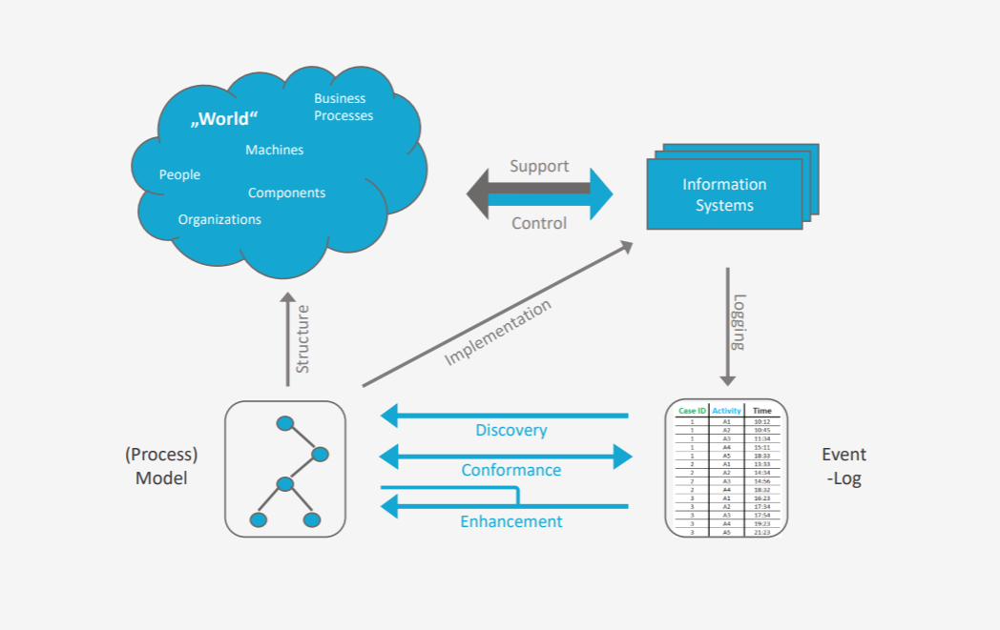

## Operations Management
Models are
- used to redesign, plan and control process flows
- tailored towards a particular analysis technique
- only used for answering a specific question

## Business Process Management
Process models serve multiple purposes

## Goal
Decide on which activities need to be executed an in what order

## Event Logging
- Data is captured from existing information systems
    - sensors & IoT devices
    - system interaction
- This data is stored in a huge event log
## The data model
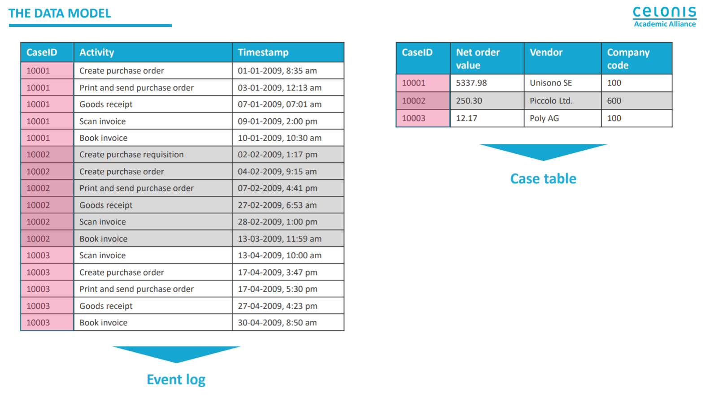
## Use cases

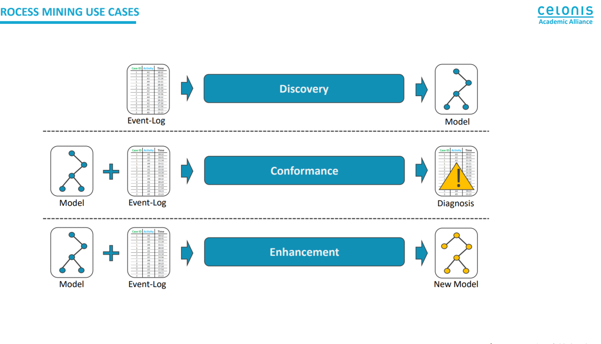

# Data Driven Organizations and Data Analytics
- Key process performance indicators
- Process execution predictions
- Decision making support services
- Process mining
- Dynamic process adaptation
- People to task assignment
- Compliance verification
- Product and service advertisement
- Sentiment analysis
- Demographics analysis
- Virality
- Social network insights
  
# Data Used for Analytics
- Structured
  - CRM
  - ERP
  - DW/BI
- Semi-structured
  - email
  - JSON
  - XML
- Unstructured 
  - documents
  - multimedia
  - social media

# Machine Learning
- Machine learning is an application of artificial intelligence (AI) that provides systems the ability to automatically learn and improve from experience without being explicitly programmed.
- Machine learning focuses on the development of 'computer programs that can access data and use it learn for themselves'

# Useful Terminology
- Features: The number of features or distinct traits that can be used to describe each item in a quantitative manner
- Samples: A sample is an item to process (eg. classify). It can be a document, picture, sounds, videos, CSV file or whatever with fixed set of quantitative traits.
- Feature vector: is an n-dimensional vector of numerical features that represent some object.
- Feature extraction
  - Preparation of feature vector
  - Transforms the data in the high-dimensional space to a space of fewer dimensions.
- Training/Evolution set
  - Set of data to discover potentially predictive relationships.

## Machine Learning for Data Analytics
1. Define and Initialize a Model
2. Train your model (using your training data-set)
3. Validate the model (by prediction using your test data set)
4. Use it: Explore or Deploy as a web service
5. Update and Re-validate
   
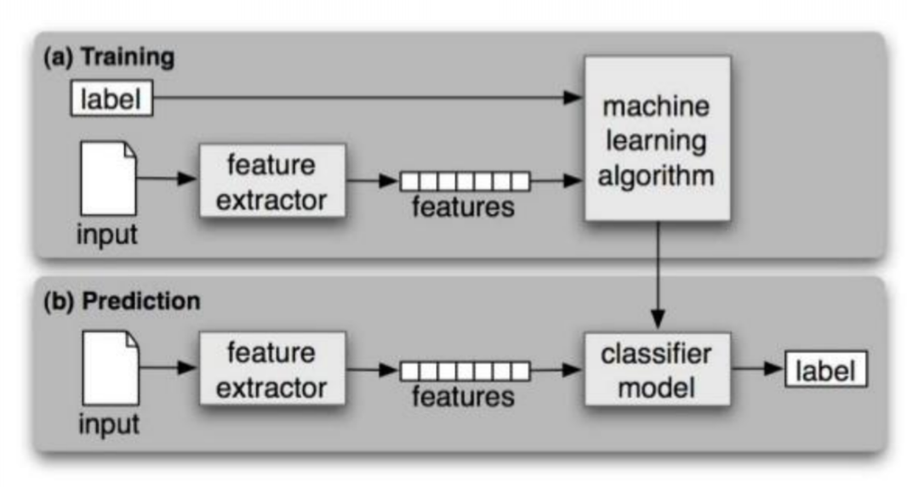

# Regression Analysis
- Supervised ML
  - Regression
    - Simple Linear Regression
    - Multiple Linear Regression
    - Polynomial Linear Regression

## Linear Regression
- Independent Variables (features): An independent variable is a variable that is manipulated to determine the value of a dependent variable. Simply, they are the features which we want to use to predict some given value of Y. It can be also called explanatory variable.
- Dependent Variable (target): The dependent variable depends on the values of the independent variable. Simply put, it's the feature which we are trying to predict. This can also be commonly known as a response variable.

## How Linear Regression Works
Y = f(X) + e
- Y: Final exam mark
- X: Assignment Results
- f: function that describes the relationship between X and Y
- e: Random error term with a mean zero

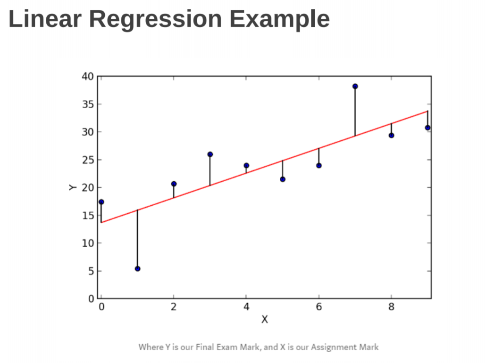

# Classification
- Supervised learning
- You need the data labeled with the correct answer to train the algorithm.
- Trained classifiers then can map input data to a category

# Clustering
- Unsupervised learning
- Automated grouping of objects into so called clusters
- Objects of the same group are similar
- Different groups are dissimilar

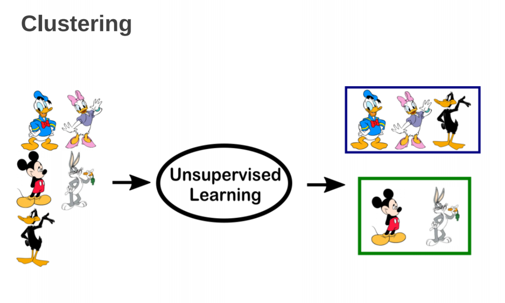

# K-Nearest Neighbor (k-NN)
- The KNN classifier is a non parametric and instance-based learning algorithm
- Non-parametric means it makes no explicit assumptions about the functional form of how the prediction is made, avoiding the dangers of mismodeling the underlying distribution of the data.
- Instance-based learning means that our algorithm doesn't explicitly learn a model. Instead, it chooses to memorize the training instances which are subsequently used as knowledge for the prediction phase.
## Algorithm
Give a training set X_train with labels Y_train, given a new instance X_test to be classified:
1. Find the most similar instances  (let's call them X_NN) to X_test that are in X_train.
2. Get the labels Y_NN for the instances in X_NN.
3. Predict the label for X_test by combining the labels Y_NN (using majority rule)

## Requirements
1. A distance metric (usually euclidean)
2. How many nearest neighbors to look at (eg. Five)
3. Optional weighting function on the neighbors points (eg. closer points are weighted higher than farther points)
4. How to aggregate the classes of neighbors points (ie. simple majority voting)

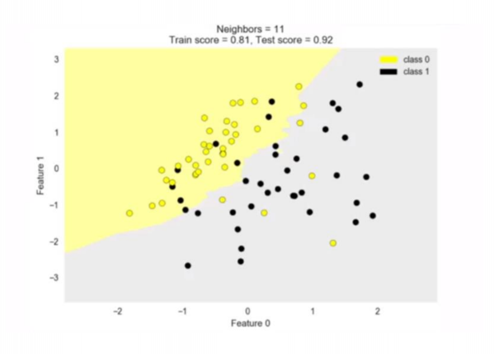

## Other notes
- Each row in the data-set refers to an 'instance'
- Remember to inspect your data

# Generalization, Over-fitting and Under-fitting
- Generalization ability refers to an algorithm's ability to give accurate predictions for new, previously unseen data.
- Assumptions:
  - Future unseen data (test set) will have the same properties as the current training sets.
  - Thus, models that are accurate on the training set are expected to be accurate on the test set.
  - But that may not happen if the trained model is turned too specifically to the training set.
  - But that may not happen if the trained model is turned too specifically to the training set.
- Models that are too complex for the amount of training data available are said to over-fit and are not likely to generalize well to new examples.
- Models that are too simple, that don't even do well on the training data, are said to under-fit and also not likely to generalize well.

# Accuracy with Imbalanced Classes
- Supposed you have two classes:
    - The positive class
    - The negative class
- Out of 1000 randomly selected items, on average
    - One item belongs to the positive class
    - The rest (999), belong to the negative class
- The accuracy will be
  - Accuracy = #correct predictions / #total instances
- When you build a classifier to predict the items, you may find out that the accuracy on the test set is 99.9%
- Be aware that this is not a good measure of how good the classifier is.
- For comparison, if we have a "dummy" classifier that doesn't consider the features at all but rather blindly predict according to the most frequent class.
- If we use the same data-set mentioned in the previous slide (1000 data instance with 999 negative and 1 positive).
    - Accuracy = 999/1000 = 99.9%
- Hence the accuracy alone sometimes is not a good metric to measure how good the model is.

# Precision and Recall
## Precision
- What proportion of positive identifications was actually correct?

Precision = TP / (TP + FP)

# Recall
- What proportion of actual positives was identified correctly?

Recall = TP / (TP + FN)

# Cross validation
- Cross validation is a re-sampling procedure used to evaluate machine learning models on a limited data sample.
- This procedure has a single parameter called k that refers to the number of groups that a given data sample is to be split into.
- As such, the procedure is often call k-fold cross-validation.
- When a specific value for k is chosen, it may be used in place of k in the reference to the model, such as k=5 becoming 5-fold cross validation.

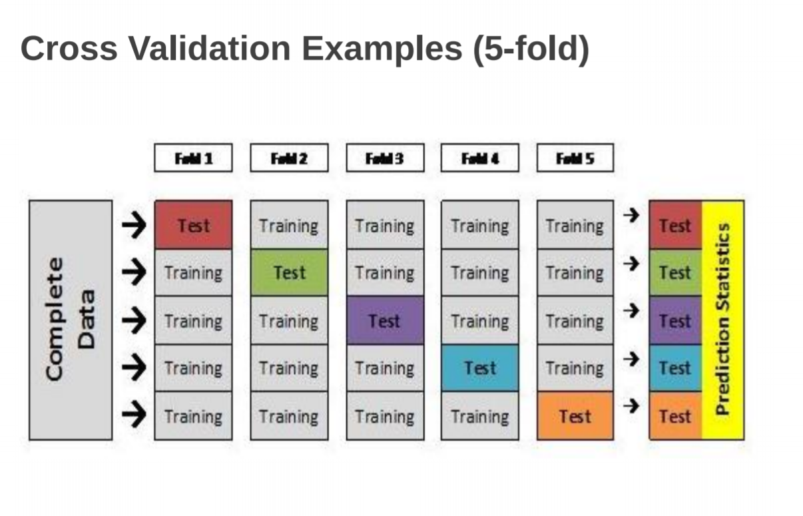

# Regression Analysis
- A linear model is a sum of weighted variables that predict a target output value given an input data instance.
- Example: Predicting house prices
- House Features: taxes paid per year (X_tax), age in years (X_age)
- Predicted Price = 143000 + 100X_tax - 4000X_age
- So if the house tax per year is 20000, and the age of the house is 60 years then the predicted selling price is:
- Predicted price = 80000 + 100*20000 - 4000*60 = 1840000

## How Linear Regression works
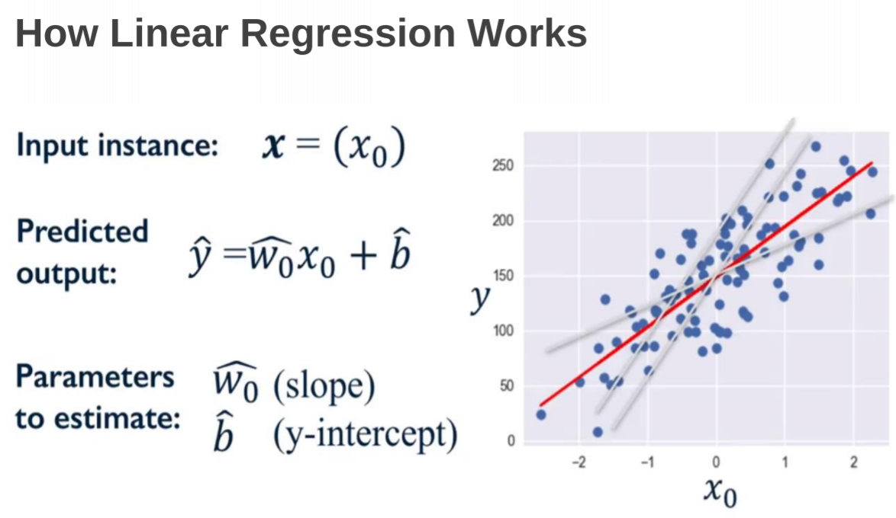

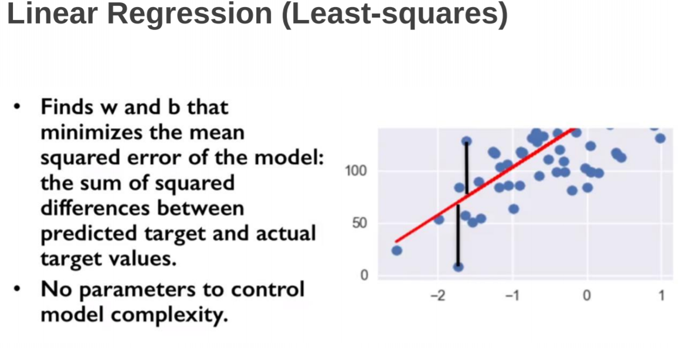

# Unsupervised Learning
- Unsupervised learning involves operating on data-sets without labeled responses or target values.
- The goal is to capture a structure of interest of useful information (eg. relationships)
- Useful for
    - Visualizing the structure of a complex data-set 
    - Compressing and summarizing the data
    - Extracting features for supervised learning 
    - Discover groups or outliers

# Clustering
- Finding a way to group data in a data-sets (putting them in clusters)
- Data points within the same cluster should be close or similar in some way
- Data points in different clusters should be far away or differ in some way

## K-means Clustering Algorithm
- Initialize
    - Decide the number of k clusters you want to find.
    - Pick k random points to serve as initial guess of the cluster centers
- Step A:
    - Assign each data point to the nearest cluster centers
- Step B:
    - Update each cluster center by replacing it with the mean of all points assigned to that center (from step A)
- Iterate:
    - Iterate over steps A and B until centers converge to a stable solution

## Limitation of k-means
- Sometimes the number of clusters is difficult to determine
- Doesn't do well with complex or irregular clusters
- Has a problem with data containing outliers

# How to select the machine learning model
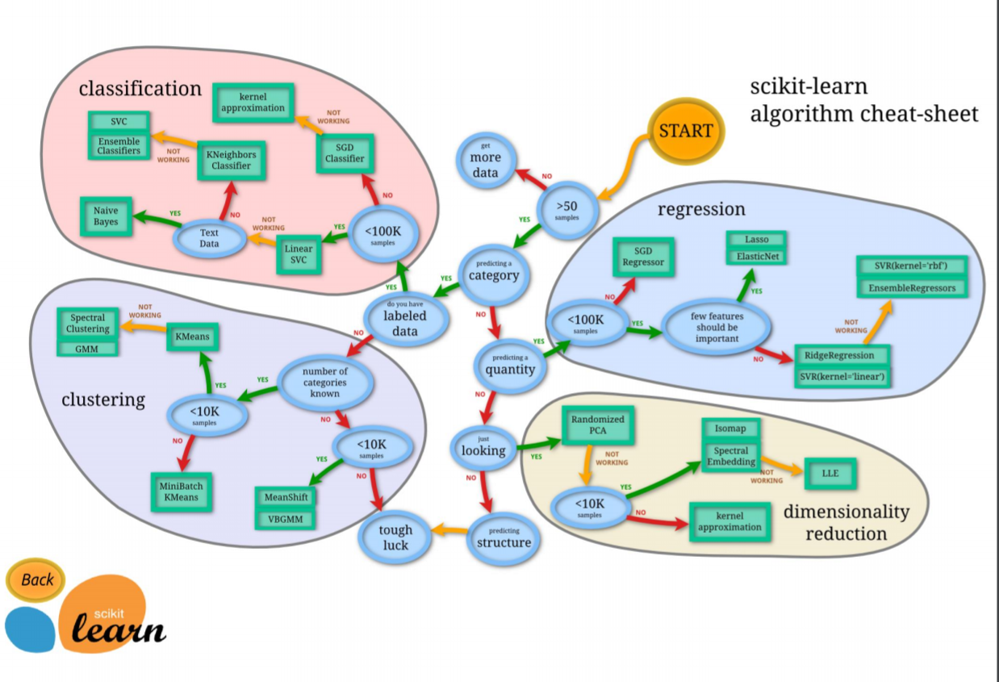